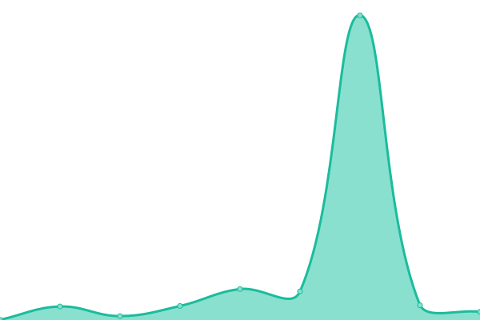
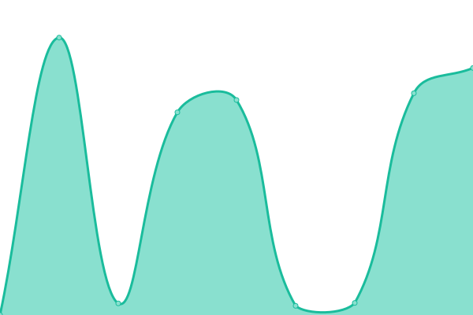
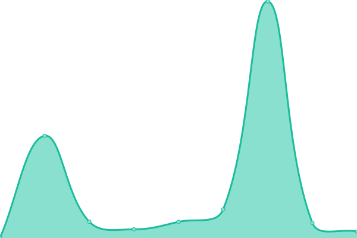

# [📈 Live Status](https://integrodevops.github.io/Project-Monitor): <!--live status--> **🟧 Partial outage**

This repository contains the open-source uptime monitor and status page for [integrodevops](https://integrodevops.github.io/Project-Monitor), powered by [Upptime](https://github.com/upptime/upptime).

With [Upptime](https://upptime.js.org), you can get your own unlimited and free uptime monitor and status page, powered entirely by a GitHub repository. We use [Issues](https://github.com/integrodevops/Project-Monitor/issues) as incident reports, [Actions](https://github.com/integrodevops/Project-Monitor/actions) as uptime monitors, and [Pages](https://integrodevops.github.io/Project-Monitor) for the status page.

<!--start: status pages-->
<!-- This summary is generated by Upptime (https://github.com/upptime/upptime) -->
<!-- Do not edit this manually, your changes will be overwritten -->
<!-- prettier-ignore -->
| URL | Status | History | Response Time | Uptime |
| --- | ------ | ------- | ------------- | ------ |
|  [Norden - Client](https://norden-mfg.netlify.app) | 🟩 Up | [norden-client.yml](https://github.com/integrodevops/Project-Monitor/commits/HEAD/history/norden-client.yml) | 

 356ms
     
 | 

<a href="https://integrodevops.github.io/Project-Monitor/history/norden-client">100.00%</a>
    

|  [Norden - API](https://norden-mfg.uk.r.appspot.com/api/hello) | 🟩 Up | [norden-api.yml](https://github.com/integrodevops/Project-Monitor/commits/HEAD/history/norden-api.yml) | 

 599ms
     
 | 

<a href="https://integrodevops.github.io/Project-Monitor/history/norden-api">100.00%</a>
    

|  [VIP - Client(Netlify)](https://vippuppies.netlify.app) | 🟩 Up | [vip-client-netlify.yml](https://github.com/integrodevops/Project-Monitor/commits/HEAD/history/vip-client-netlify.yml) | 

 348ms
     
 | 

<a href="https://integrodevops.github.io/Project-Monitor/history/vip-client-netlify">100.00%</a>
    

|  [VIP - Client](https://vippuppies.com) | 🟩 Up | [vip-client.yml](https://github.com/integrodevops/Project-Monitor/commits/HEAD/history/vip-client.yml) | 

 497ms
     
 | 

<a href="https://integrodevops.github.io/Project-Monitor/history/vip-client">100.00%</a>
    

|  [VIP - API](https://vip-puppies-prod.appspot.com/api-meta) | 🟥 Down | [vip-api.yml](https://github.com/integrodevops/Project-Monitor/commits/HEAD/history/vip-api.yml) | 

 186ms
     
 | 

<a href="https://integrodevops.github.io/Project-Monitor/history/vip-api">100.00%</a>
    

|  [R&R - Client](https://rre-prod.netlify.app) | 🟩 Up | [r-and-r-client.yml](https://github.com/integrodevops/Project-Monitor/commits/HEAD/history/r-and-r-client.yml) | 

 696ms
     
 | 

<a href="https://integrodevops.github.io/Project-Monitor/history/r-and-r-client">100.00%</a>
    

|  [Integro 212 - Client](https://www.integro212.com) | 🟩 Up | [integro-212-client.yml](https://github.com/integrodevops/Project-Monitor/commits/HEAD/history/integro-212-client.yml) | 

 362ms
     
 | 

<a href="https://integrodevops.github.io/Project-Monitor/history/integro-212-client">100.00%</a>
    

<!--end: status pages-->

[**Visit our status website →**](https://integrodevops.github.io/Project-Monitor)

## 📄 License

- Powered by: [Upptime](https://github.com/upptime/upptime)
- Code: [MIT](./LICENSE) © [integrodevops](https://integrodevops.github.io/Project-Monitor)
- Data in the `./history` directory: [Open Database License](https://opendatacommons.org/licenses/odbl/1-0/)
